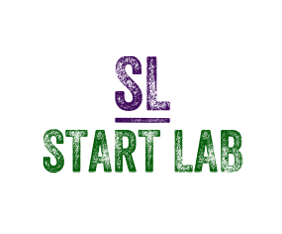

---

---

#  

# **Automating the Data Upload**

The [National Data Archive](#Help-Section) (NDA) needs the following [measures](#Help-Section) to be uploaded every 6 months, due July 15th and January 15th. This is a project aimed at automating the process in [R](#Help-Section) through manipulating excel files. We'll be [mapping](#Help-Section) certain columns in one excel sheet to a column in a different excel sheet. This is needed because question 1 of one of our measures may not be question 1 in the NDA provided [structure](#Help-Section). Each person will be responsible for writing a [function](#Help-Section) in R that meets the requirements of their measure. I have already written you a [skeleton function](#Help-Section) which will need to be filled in. Each measure will have specific detailed instructions and an [Item matching chart](#Help-Section) that will serve as your guide. Read through the [Getting Starting](#Getting-Started) section below to make sure you have everything you need. After that, you can use the table of contents below to click on your assigned measure and get started. For more information and an explanation for highlighted words see the [Help Section](#Help-Section) at the bottom of the page.

## **Motivation**

The current process for doing the data upload is needlessly tedious, time consuming, and prone to human error. Automating the process in R will turn a large, multiple day endeavor, into a streamline process that significantly decreases the likelihood for human error. Ultimately, this will save time and improve the validity of the content that we're uploading. 

## Table of Contents

| Measures               | Assigned To... | Status      |
| ------------------------- | ------ | ----------- |
| [Pedigree](#Research-Subject-Pedigree) | TBD            | In Progress |
| [SCID](#Structured-Clinical-Interview-for-DSM-V---SCID) |TBD|In Progress |
| [SID-P](#Structured-Interview-for-DSM-IV-Personality---SID-P) | TBD | In Progress |
| [PPVT](#Peabody-Picture-Vocabulary-Test---PPVT) | TBD | In Progress |
| [DERS](#Difficulties-in-Emotion-Regulation-Scale---DERS) | TBD | In Progress |
| [CBCL](#Child-Behavior-Checklist---CBCL) | Austin | In Progress |
| [CCNES](#Coping-with-Children's-Negative-Emotions-Scale---CCNES) | Min | In Progress |
| [AAQ](#Acceptance-and-Action-Questionnaire---AAQ) | Bryan | In Progress |
| [WCCL](#Ways-of-Coping-Checklist---WCCL) | Kyle | In Progress |
| [PKBS](#Preschool-and-Kindergarten-Behavior-Scale---PKBS) | Jake | In Progress |
| [Bear Dragon](#Bear-Dragon)             | TBD | In Progress |
| [Affect Perspective Taking](Affect-Perspective-Taking) | TBD | In Progress |
| [Dimensional Card Sort](#Dimensional-Card-Sort) | TBD | In Progress |
| [Emotion Labeling](#Emotion-Labeling) | TBD | In Progress |
| [Emotion Strategies](#Emotion-Strategies) | TBD | In Progress |

---

# **Getting Started**

***Things You'll Need And How To Get It:*** 

- **R** is a programming language. Download it [here](https://cloud.r-project.org/).
- **Rstudio** is the software we'll use to code in R. You download it [here](http://bit.ly/DownloadRstudio).
- **GitHub Desktop** is how we will download and upload our code in a centralized place. Download it [here](https://desktop.github.com/).
- **Google.com** is your best friend while coding. Try to work through errors and find simpler ways to do things!

---

# **Research Subject Pedigree**

The Pedigree is a collection of identifiable information that needs to be appended to every measure. 

## Pedigree instructions:

[Back to Table of Contents](#Table-of-Contents)

---

# **Structured Clinical Interview for DSM-V - SCID**

The Structured Clinical Interview for DSM‐5(SCID‐5) is a semi-structured interview guide for making the major DSM‐5 diagnoses.

## SCID instructions:


[Back to Table of Contents](#Table-of-Contents)

---

# **Structured Interview for DSM IV Personality - SID-P**

The Structured Clinical Interview for DSM-4 is a guide for making personality disorder diagnoses. 

## SID-P instructions:


[Back to Table of Contents](#Table-of-Contents)

---

# **Peabody Picture Vocabulary Test - PPVT**

The Peabody Picture Vocabulary Test is an untimed test of receptive vocabulary for Standard American English and is intended to provide a quick estimate of the examinee's receptive vocabulary ability.

## PPVT instructions:


[Back to Table of Contents](#Table-of-Contents)

---

# **Difficulties in Emotion Regulation Scale - DERS**

The DERS is a classroom observation tool that measures environmental and behavioral qualities proven to support those outcomes— for any developmental educational model, not just Montessori.

## DERS instructions: 

### 1) Importing

- Install all the [packages](#Help-Section) required for the project. You can find what's needed in the [Help Section](#Help-Section). 
- Read in all the CSVs needed. The files you'll need are located in your measure's folder. Check the [Help Section](#Help-Section) for example code.


### 2) Editing and Renaming

- Edit and rename UO and UPMC data so that it only has the information needed for the NDA structure. Reference the Item matching chat below to see what items you will need to select. See "Example of Selecting and Renaming UO/UPMC Data in a Measure" in the [Help Section](#Help-Section) for example code. 

- Next, now that all the measures for each time point from both sites have the same amount of columns and the same names for those columns, we will bind them together by time point. This will be combining *UO_T1_DERS* and *UPMC_T1_DERS* into one data frame called *DERS_T1*. This will be repeated for each time point. See "Example of Binding UO and UPMC Data Frames by Time Point" in the [Help Section](#Help-Section) for example code.

- Now that we have our 4 files separated by time point we want merge the relevant Pedigree information into our data frames. Modify the Pedigree information so that it only contains the relevant data for T1 and then merge by *FamID*. See "Example of Merging Pedigree info with the Data Frames" in the [Help Section](#Help-Section) for example code.

  *<u>Relevant Pedigree information: mom guid, mom famID, T1-T4 Mom ages, T1-T4 interview dates, Mom sex.</u>*

- At this step we should have 4 files containing UO and UPMC data separated by time point and all the relevant pedigree information should be merged into all 4 files. But because we merged slighted different information into our sheets the columns names currently do not match so we cannot yet merge all of our data frames into one. So, we'll rename the date and age columns in each data frame so that their columns match. See "Example of Renaming the Date and Age Columns so They Match" in the [Help Section](#Help-Section) for example code.

- Before we do our final bind we will add a column to each data frame called timepoint and we'll give the contents of that column which ever time point that data set represents. See "Example of Adding a New Time Point Column and Adding a Value to it" in the [Help Section](#Help-Section) for example code.

- Now we'll bind all 4 data sets into one the same way that we blinded time points together! This will be the DERS_prep data frame.

### 3) Recoding Text to Numbers and Reverse Scoring:

Take the following text strings and turn them into integers using the key below.

| Text String         | Integer |
| :------------------ | :------ |
| almost never        | 1       |
| sometimes           | 2       |
| about half the time | 3       |
| most of the time    | 4       |
| almost always       | 5       |

Take the following question items and reverse score them as the chart indicates.

| Question Number |        New Value        |
| :-------------: | :---------------------: |
|     ders001     | 1=5, 2=4, 3=3, 4=2. 5=1 |
|     ders002     | 1=5, 2=4, 3=3, 4=2. 5=1 |
|     ders006     | 1=5, 2=4, 3=3, 4=2. 5=1 |
|     ders007     | 1=5, 2=4, 3=3, 4=2. 5=1 |
|     ders008     | 1=5, 2=4, 3=3, 4=2. 5=1 |
|     ders010     | 1=5, 2=4, 3=3, 4=2. 5=1 |
|     ders017     | 1=5, 2=4, 3=3, 4=2. 5=1 |
|     ders020     | 1=5, 2=4, 3=3, 4=2. 5=1 |
|     ders022     | 1=5, 2=4, 3=3, 4=2. 5=1 |
|     ders024     | 1=5, 2=4, 3=3, 4=2. 5=1 |
|     ders034     | 1=5, 2=4, 3=3, 4=2. 5=1 |

### 4) Create calculated Columns

Insert the following columns at the end of your MeasureName_Prep sheet:

1. Column **ders_awareness:** The scoring for ders_awareness is the **SUM** of these items: 

   ```
   ders_02, ders_06, ders_08, ders_10, ders_17, ders_34 
   ```

2. Column **ders_clarity:** The scoring for ders_clarity is the **SUM** of these items:

   ```
   ders_01, ders_04, ders_05, ders_07, ders_09
   ```

3. Column **ders_goals**: The scoring for ders_goals is the **SUM** of these items:

   ```
   ders_13, ders_18, ders_20, ders_26, ders_33
   ```

4. Column **ders_impulse**: The scoring for ders_impulse is the **SUM** of these items:

   ```
   ders_03, ders_14, ders_19, ders_24, ders_27, ders_32
   ```

5. Column **ders_nonacceptance**: The scoring for ders_nonacceptance is the **SUM** of these items:

   ```
   ders_11, ders_12, ders_21, ders_23, ders_25, ders_29
   ```

6. Column **ders_strategies**: The scoring for ders_strategies is the **SUM** of these items:

   ```
   ders_15, ders_16, ders_22, ders_28, ders_30, ders_31, ders_35, ders_36
   ```

7. Column **ders_total:** The scoring for ders_total is the **SUM** of these items:

   ```
   ders_01, ders_02, ders_03, ders_04, ders_05, ders_06, ders_07, ders_08, ders_09, ders_10, ders_11, ders_12, ders_13, ders_14, ders_15, ders_16, ders_17, ders_18, ders_19, ders_20, ders_21, ders_22, ders_23, ders_24, ders_25, ders_26, ders_27, ders_28, ders_29, ders_30, ders_31, ders_32, ders_33, ders_34, ders_35, ders_36  
   ```

### 5) Add to the NDA Structure 

Now that your prep sheet is complete and contain all the columns as indicated in the Item matching chart move the columns into the NDA structure. 

## DERS Item Matching Chart:

| *UPMC* **Qualtrics Question Number:** | *UO* **Qualtrics Question Number:** | DERS Prep Sheet:   | ***NDA* Data Structure:** |
| ------------------------------------- | ----------------------------------- | ------------------ | ------------------------- |
| N/A                                   | N/A                                 | mom_guid           | subjectkey                |
| Q1.2                                  | famID                               | mom_famID          | src_subject_id            |
| N/A                                   | N/A                                 | interview_age      | interview_age             |
| N/A                                   | N/A                                 | interview_date     | interview_date            |
| N/A                                   | N/A                                 | sex                | sex                       |
| N/A                                   | N/A                                 | timepoint          | visit                     |
| Q6.1_1                                | Q137_1                              | srm_ders_01            | ders1                     |
| Q6.1_2                                | Q137_2                              | srm_ders_02            | ders2                     |
| Q6.1_3                                | Q137_3                              | srm_ders_03            | ders3                     |
| Q6.1_4                                | Q137_4                              | srm_ders_04            | ders4                     |
| Q6.1_5                                | Q137_5                              | srm_ders_05            | ders5                     |
| Q6.1_6                                | Q137_6                              | srm_ders_06            | ders6                     |
| Q6.1_7                                | Q137_7                              | srm_ders_07            | ders7                     |
| Q6.1_8                                | Q137_8                              | srm_ders_08            | ders8                     |
| Q6.1_9                                | Q137_9                              | srm_ders_09            | ders9                     |
| Q6.1_10                               | Q137_10                             | srm_ders_10            | ders10                    |
| Q6.1_11                               | Q137_11                             | srm_ders_11            | ders11                    |
| Q6.1_12                               | Q137_12                             | srm_ders_12            | ders12                    |
| Q6.1_13                               | Q137_13                             | srm_ders_13            | ders13                    |
| Q6.1_14                               | Q137_14                             | srm_ders_14            | ders14                    |
| Q6.1_15                               | Q137_15                             | srm_ders_15            | ders15                    |
| Q6.1_16                               | Q137_16                             | srm_ders_16            | ders16                    |
| Q6.1_17                               | Q137_17                             | srm_ders_17            | ders17                    |
| Q6.1_18                               | Q137_18                             | srm_ders_18            | ders18                    |
| Q6.1_19                               | Q137_19                             | srm_ders_19            | ders19                    |
| Q6.1_20                               | Q137_20                             | srm_ders_20            | ders20                    |
| Q6.1_21                               | Q137_21                             | srm_ders_21            | ders21                    |
| Q6.1_22                               | Q137_22                             | srm_ders_22            | ders22                    |
| Q6.1_23                               | Q137_23                             | srm_ders_23            | ders23                    |
| Q6.1_24                               | Q137_24                             | srm_ders_24            | ders24                    |
| Q6.1_25                               | Q137_25                             | srm_ders_25            | ders25                    |
| Q6.1_26                               | Q137_26                             | srm_ders_26            | ders26                    |
| Q6.1_27                               | Q137_27                             | srm_ders_27            | ders27                    |
| Q6.1_28                               | Q137_28                             | srm_ders_28            | ders28                    |
| Q6.1_29                               | Q137_29                             | srm_ders_29            | ders29                    |
| Q6.1_30                               | Q137_30                             | srm_ders_30            | ders30                    |
| Q6.1_31                               | Q137_31                             | srm_ders_31            | ders31                    |
| Q6.1_32                               | Q137_32                             | srm_ders_32            | ders32                    |
| Q6.1_33                               | Q137_33                             | srm_ders_33            | ders33                    |
| Q6.1_34                               | Q137_34                             | srm_ders_34            | ders34                    |
| Q6.1_35                               | Q137_35                             | srm_ders_35            | ders35                    |
| Q6.1_36                               | Q137_36                             | srm_ders_36            | ders36                    |
| N/A                                   | N/A                                 | srm_ders_awareness     | ders_awareness            |
| N/A                                   | N/A                                 | srm_ders_clarity       | ders_clarity              |
| N/A                                   | N/A                                 | srm_ders_goals         | ders_goals                |
| N/A                                   | N/A                                 | srm_ders_impulse       | ders_impulse              |
| N/A                                   | N/A                                 | srm_ders_nonacceptance | ders_nonacceptance        |
| N/A                                   | N/A                                 | srm_ders_strategies    | ders_strategies           |
| N/A                                   | N/A                                 | srm_ders_total         | ders_total                |

[Back to Table of Contents](#Table-of-Contents)

---

# **Child Behavior Checklist - CBCL**

The Child Behavior Checklist (CBCL) is a checklist parents complete to detect emotional and behavioral problems in children and adolescents.

## CBCL instructions: 

### 1) Importing

- Install all the [packages](#Help-Section) required for the project. You can find what's needed in the [Help Section](#Help-Section). 
- Read in all the CSVs needed. The files you'll need are located in your measure's folder. Check the [Help Section](#Help-Section) for example code.


### 2) Editing and Renaming

- Edit and rename UO and UPMC data so that it only has the information needed for the NDA structure. Reference the Item matching chat below to see what items you will need to select. See "Example of Selecting and Renaming UO/UPMC Data in a Measure" in the [Help Section](#Help-Section) for example code. 

- Next, now that all the measures for each time point from both sites have the same amount of columns and the same names for those columns, we will bind them together by time point. This will be combining *UO_T1_AAQ* and *UPMC_T1_AAQ* into one data frame called *AAQ_T1*. This will be repeated for each time point. See "Example of Binding UO and UPMC Data Frames by Time Point" in the [Help Section](#Help-Section) for example code.

- Now that we have our 4 files separated by time point we want merge the relevant Pedigree information into our data frames. Modify the Pedigree information so that it only contains the relevant data for T1 and then merge by *FamID*. See "Example of Merging Pedigree info with the Data Frames" in the [Help Section](#Help-Section) for example code.

  *<u>Relevant Pedigree information: child guid, child famID, T1-T4 child ages, T1-T4 interview dates, child sex.</u>*

- At this step we should have 4 files containing UO and UPMC data separated by time point and all the relevant pedigree information should be merged into all 4 files. But because we merged slighted different information into our sheets the columns names currently do not match so we cannot yet merge all of our data frames into one. So, we'll rename the date and age columns in each data frame so that their columns match. See "Example of Renaming the Date and Age Columns so They Match" in the [Help Section](#Help-Section) for example code.

- Before we do our final bind we will add a column to each data frame called timepoint and we'll give the contents of that column which ever time point that data set represents. See "Example of Adding a New Time Point Column and Adding a Value to it" in the [Help Section](#Help-Section) for example code.

- Now we'll bind all 4 data sets into one the same way that we blinded time points together! This will be the CBCL_prep data frame.

### 3) Recoding Text to Numbers and Reverse Scoring:

Take the following text strings and turn them into integers using the key below:

| Text String                | Integer |
| :------------------------- | :------ |
| Not True                   | 0       |
| Somewhat or sometimes true | 1       |
| Very true or often true    | 2       |

### 4) Create calculated Columns

Insert the following columns at the end of your MeasureName_Prep sheet:

1. Column **srm_cbcl_er:** The scoring for srm_cbcl_er is the **SUM** of these items: 

   ```R
   cbcl_021, cbcl_046, cbcl_051, cbcl_079, cbcl_082, cbcl_083, cbcl_092, cbcl_097, cbcl_099
   ```

2. Column **srm_cbcl_ad:** The scoring for srm_cbcl_ad is the **SUM** of these items:

   ```R
   cbcl_010, cbcl_033, cbcl_037, cbcl_043, cbcl_047, cbcl_068, cbcl_087, cbcl_090
   ```

3. Column **srm_cbcl_sc:** The scoring for srm_cbcl_sc is the **SUM** of these items:

   ```R
   cbcl_001, cbcl_007,cbcl_L012, cbcl_019, cbcl_024, cbcl_039, cbcl_045, cbcl_052, cbcl_078, cbcl_086, cbcl_093
   ```

4. Column **srm_cbcl_w:** The scoring for srm_cbcl_w is the **SUM** of these items:

   ```R
   cbcl_002, cbcl_004, cbcl_023, cbcl_062, cbcl_067, cbcl_070, cbcl_071, cbcl_098
   ```

5. Column **srm_cbcl_sp:** The scoring for srm_cbcl_sp is the **SUM** of these items:

   ```R
   cbcl_022, cbcl_038, cbcl_048, cbcl_064, cbcl_074, cbcl_084
   ```

6. Column **srm_cbcl_ap:** The scoring for srm_cbcl_ap is the **SUM** of these items:

   ```R
   cbcl_005, cbcl_006, cbcl_056, cbcl_059, cbcl_095
   ```

7. Column **srm_cbcl_ab:** The scoring for srm_cbcl_ab is the **SUM** of these items:

   ```R
   cbcl_008, cbcl_015, cbcl_016, cbcl_018, cbcl_020, cbcl_027, cbcl_029, cbcl_035, cbcl_040, cbcl_042, cbcl_044, cbcl_053, cbcl_058, cbcl_066, cbcl_069, cbcl_081, cbcl_085, cbcl_088, cbcl_096
   ```

8. Column **srm_cbcl_op:** The scoring for srm_cbcl_op is the **SUM** of these items:

   ```R
   cbcl_003, cbcl_009, cbcl_011, cbcl_013, cbcl_014, cbcl_017, cbcl_025, cbcl_026, cbcl_028, cbcl_030, cbcl_031, cbcl_032, cbcl_034, cbcl_036, cbcl_041, cbcl_049, cbcl_050, cbcl_054, cbcl_055, cbcl_057, cbcl_060, cbcl_061, cbcl_063, cbcl_065, cbcl_072, cbcl_073, cbcl_075, cbcl_076, cbcl_077, cbcl_080, cbcl_089, cbcl_091, cbcl_094
   ```

9. Column **srm_cbcl_int:** The scoring for srm_cbcl_int is the **SUM** of these items:

   ```R
   cbcl_021, cbcl_046, cbcl_051, cbcl_079, cbcl_082, cbcl_083, cbcl_092, cbcl_097, cbcl_099, cbcl_010, cbcl_033, cbcl_037, cbcl_043, cbcl_047, cbcl_068, cbcl_087, cbcl_090, cbcl_001, cbcl_007, cbcl_012, cbcl_019, cbcl_024, cbcl_039, cbcl_045, cbcl_052, cbcl_078, cbcl_086, cbcl_093, cbcl_002, cbcl_004, cbcl_023, cbcl_062, cbcl_067, cbcl_070, cbcl_071, cbcl_098
   ```

10. Column **srm_cbcl_ext:** The scoring for srm_cbcl_ext is the **SUM** of these items:

    ```R
    cbcl_005, cbcl_006, cbcl_056, cbcl_059, cbcl_095, cbcl_008, cbcl_015, cbcl_016, cbcl_018, cbcl_020, cbcl_027, cbcl_029, cbcl_035, cbcl_040, cbcl_042, cbcl_044, cbcl_053, cbcl_058, cbcl_066, cbcl_069, cbcl_081, cbcl_085, cbcl_088, cbcl_096
    ```

11. Column **srm_cbcl_total:** The scoring for srm_cbcl_total is the **SUM** of these items:

    ```R
    cbcl_001, cbcl_002, cbcl_003, cbcl_004, cbcl_005, cbcl_006, cbcl_007, cbcl_008, cbcl_009, cbcl_010, cbcl_011, cbcl_012, cbcl_013, cbcl_014, cbcl_015, cbcl_016, cbcl_017, cbcl_018, cbcl_019, cbcl_020, cbcl_021, cbcl_022, cbcl_023, cbcl_024, cbcl_025, cbcl_026, cbcl_027, cbcl_028, cbcl_029, cbcl_030, cbcl_031, cbcl_032, cbcl_033, cbcl_034, cbcl_035, cbcl_036, cbcl_037, cbcl_038, cbcl_039, cbcl_040, cbcl_041, cbcl_042, cbcl_043, cbcl_044, cbcl_045, cbcl_046, cbcl_047, cbcl_048, cbcl_049, cbcl_050, cbcl_051, cbcl_052, cbcl_053, cbcl_054, cbcl_055, cbcl_056, cbcl_057, cbcl_058, cbcl_059, cbcl_060, cbcl_061, cbcl_062, cbcl_063, cbcl_064, cbcl_065, cbcl_066, cbcl_067, cbcl_068, cbcl_069, cbcl_070, cbcl_071, cbcl_072, cbcl_073, cbcl_074, cbcl_075, cbcl_076, cbcl_077, cbcl_078, cbcl_079, cbcl_080, cbcl_081, cbcl_082, cbcl_083, cbcl_084, cbcl_085, cbcl_086, cbcl_087, cbcl_088, cbcl_089, cbcl_090, cbcl_091, cbcl_092, cbcl_093, cbcl_094, cbcl_095, cbcl_096, cbcl_097, cbcl_098, cbcl_099
    ```


### 5) Add to the NDA Structure 

Now that your prep sheet is complete and contains all the columns as indicated in the Item matching chart, move the columns into the NDA structure. 

## CBCL Item Matching Chart:

| *UPMC* **Qualtrics Question Number:** | *UO* **Qualtrics Question Number:** | CBCL Prep Sheet | ***NDA* Data Structure:** |
| ------------------------------------- | ----------------------------------- | ----------------------- | ----------------------- |
| N/A | N/A | child_guid | subjectkey |
| Q1.2 | famID | child_FamID | src_subject_id |
| N/A | N/A | child_sex | sex |
| N/A | N/A | interview_age | interview_age |
| N/A | N/A | interview_date | interview_date |
| N/A | N/A | relationship | relationship |
| N/A | N/A | timepoint | visit |
| Q15.1_1                                | Q264_1                            | srm_cbcl_001         | cbcl56a                 |
| Q15.1_2                                | Q264_2                             | srm_cbcl_002           | cbcl1                   |
| Q15.1_3                                | Q264_3                             | srm_cbcl_003         | cbcl_nt                 |
| Q15.1_4                                | Q264_4                             | srm_cbcl_004        | cbcl_eye                |
| Q15.1_5                                | Q264_5                             | srm_cbcl_005           | cbcl8                   |
| Q15.1_6                                | Q264_6                             | srm_cbcl_006          | cbcl10                  |
| Q15.1_7                                | Q264_7                             | srm_cbcl_007        | cbcl_out                |
| Q15.1_8                                | Q264_8                            | srm_cbcl_008       | cbcl_wait               |
| Q15.1_9                                | Q264_9                             | srm_cbcl_009       | cbcl_chew               |
| Q15.1_10                                | Q264_10                            | srm_cbcl_010         | cbcl11                  |
| Q15.1_11                                | Q264_11                            | srm_cbcl_011      | cbcl_help               |
| Q15.1_12                                | Q264_12                            | srm_cbcl_012         | cbcl49                  |
| Q15.1_13                                | Q264_13                            | srm_cbcl_013       | cbcl14                  |
| Q15.1_14                                | Q264_14                            | srm_cbcl_014         | cbcl15                  |
| Q15.1_15                                | Q264_15                            | srm_cbcl_015   | cbcl_defiant            |
| Q15.1_16                                | Q264_16                            | srm_cbcl_016       | cbcl_dem                |
| Q15.1_17                                | Q264_17                            | srm_cbcl_017         | cbcl20                  |
| Q15.1_18                                | Q264_18                            | srm_cbcl_018         | cbcl21                  |
| Q15.1_19                                | Q264_19                            | srm_cbcl_019      | cbcl_diar               |
| Q15.1_20                                | Q264_20                            | srm_cbcl_020     | cbcl_disob              |
| Q15.1_21                                | Q264_21                            | srm_cbcl_021      | cbcl_dist               |
| Q15.1_22                                | Q264_22                            | srm_cbcl_022 | cbcl_alonsleep          |
| Q15.1_23                                | Q264_23                            | srm_cbcl_023    | cbcl_answer             |
| Q15.1_24                                | Q264_24                            | srm_cbcl_024         | cbcl24                  |
| Q15.1_25                                | Q264_25                            | srm_cbcl_025         | cbcl25                  |
| Q15.1_26                                | Q264_26                            | srm_cbcl_026       | cbcl_fun                |
| Q15.1_27                                | Q264_27                            | srm_cbcl_027         | cbcl26                  |
| Q15.1_28                                | Q264_28                            | srm_cbcl_028      | cbcl_home               |
| Q15.1_29                                | Q264_29                            | srm_cbcl_029     | cbcl_frust              |
| Q15.1_30                                | Q264_30                            | srm_cbcl_030         | cbcl27                  |
| Q15.1_31                                | Q264_31                            | srm_cbcl_031       | cbcl_eat                |
| Q15.1_32                                | Q264_32                            | srm_cbcl_032         | cbcl29                  |
| Q15.1_33                                | Q264_33                            | srm_cbcl_033      | cbcl_feel               |
| Q15.1_34                                | Q264_34                            | srm_cbcl_034         | cbcl36                  |
| Q15.1_35                                | Q264_35                            | srm_cbcl_035         | cbcl37                  |
| Q15.1_36                                | Q264_36                            | srm_cbcl_036     | cbcl_every              |
| Q15.1_37                                | Q264_37                            | srm_cbcl_037    | cbcl_upset              |
| Q15.1_38                                | Q264_38                            | srm_cbcl_038 | cbcl_troubsleep         |
| Q15.1_39                                | Q264_39                            | srm_cbcl_039        | cbcl56b                 |
| Q15.1_40                                | Q264_40                            | srm_cbcl_040       | cbcl_hit                |
| Q15.1_41                                | Q264_41                            | srm_cbcl_042    | cbcl_breath             |
| Q15.1_42                                | Q264_42                            | srm_cbcl_042    | cbcl_hurt               |
| Q15.1_43                               | Q264_43                            | srm_cbcl_043     | cbcl_unhap              |
| Q15.1_44                                | Q264_44                            | srm_cbcl_044     | cbcl_angry              |
| Q15.1_45                                | Q264_45                            | srm_cbcl_045        | cbcl56c                 |
| Q15.1_46                                | Q264_46                            | srm_cbcl_046         | cbcl46                  |
| Q15.1_47                                | Q264_47                            | srm_cbcl_047         | cbcl45                  |
| Q15.1_48                               | Q264_48                           | srm_cbcl_048         | cbcl47                  |
| Q15.1_49                                | Q264_49                            | srm_cbcl_049         | cbcl53                  |
| Q15.1_50                                | Q264_50                            | srm_cbcl_050         | cbcl54                  |
| Q15.1_51                                | Q264_51                            | srm_cbcl_051     | cbcl_panic              |
| Q15.1_52                                | Q264_52                            | srm_cbcl_052       | cbcl_bow                |
| Q15.1_53                                | Q264_53                            | srm_cbcl_053         | cbcl57                  |
| Q15.1_54                                | Q264_54                            | srm_cbcl_054         | cbcl58                  |
| Q15.1_55                                | Q264_55                            | srm_cbcl_055         | cbcl60                  |
| Q15.1_56                                | Q264_56                            | srm_cbcl_056         | cbcl62                  |
| Q15.1_57                                | Q264_57                            | srm_cbcl_057        | cbcl56d                 |
| Q15.1_58                                | Q264_58                            | srm_cbcl_058    | cbcl_punish             |
| Q15.1_59                                | Q264_59                            | srm_cbcl_059     | cbcl_shift              |
| Q15.1_60                                | Q264_60                            | srm_cbcl_060        | cbcl56e                 |
| Q15.1_61                                | Q264_61                            | srm_cbcl_061   | cbcl_reat               |
| Q15.1_62                                | Q264_62                            | srm_cbcl_062     | cbcl_play               |
| Q15.1_63                                | Q264_63                            | srm_cbcl_063     | cbcl_rock               |
| Q15.1_64                                | Q264_64                            | srm_cbcl_064       | cbcl_bed                |
| Q15.1_65                                | Q264_65                            | srm_cbcl_065   | cbcl_toil               |
| Q15.1_66                                | Q264_66                            | srm_cbcl_066         | cbcl68                  |
| Q15.1_67                                | Q264_67                            | srm_cbcl_067       | cbcl_aff                |
| Q15.1_68                                | Q264_68                            | srm_cbcl_068         | cbcl71                  |
| Q15.1_69                                | Q264_69                            | srm_cbcl_069   | cbcl_selfish            |
| Q15.1_70                                | Q264_70                            | srm_cbcl_070  | cbcl_littleaf           |
| Q15.1_71                                | Q264_71                            | srm_cbcl_071    | cbcl_inter              |
| Q15.1_72                                | Q264_72                            | srm_cbcl_072      | cbcl_fear               |
| Q15.1_73                                | Q264_73                            | srm_cbcl_073         | cbcl75                  |
| Q15.1_74                                | Q264_74                            | srm_cbcl_074         | cbcl76                  |
| Q15.1_75                                | Q264_75                            | srm_cbcl_075     | cbcl_smear              |
| Q15.1_76                                | Q264_76                            | srm_cbcl_076         | cbcl79                  |
| Q15.1_77                                | Q264_77                            | srm_cbcl_077    | cbcl_stares             |
| Q15.1_78                                | Q264_78                            | srm_cbcl_078        | cbcl56f                 |
| Q15.1_79                                | Q264_79                            | srm_cbcl_079       | cbcl_sad                |
| Q15.1_80                                | Q264_80                            | srm_cbcl_080         | cbcl84                  |
| Q15.1_81                                | Q264_81                            | srm_cbcl_081          | cbcl86                  |
| Q15.1_82                                | Q264_82                            | srm_cbcl_082         | cbcl87                  |
| Q15.1_83                                | Q264_83                            | srm_cbcl_083         | cbcl88                  |
| Q15.1_84                                | Q264_84                            | srm_cbcl_084      | cbcl_crie               |
| Q15.1_85                                | Q264_85                            | srm_cbcl_085       | cbcl95                  |
| Q15.1_86                                | Q264_86                            | srm_cbcl_086     | cbcl_clean              |
| Q15.1_87                                | Q264_87                           | srm_cbcl_087         | cbcl50                  |
| Q15.1_88                                | Q264_88                            | srm_cbcl_088    | cbcl_uncoop             |
| Q15.1_89                                | Q264_89                       | srm_cbcl_089        | cbcl102                 |
| Q15.1_90                                | Q264_90                       | srm_cbcl_090        | cbcl103                 |
| Q15.1_91                                | Q264_91                       | srm_cbcl_091        | cbcl104                 |
| Q15.1_92                                | Q264_92                       | srm_cbcl_092    | cbcl_people             |
| Q15.1_93                                | Q264_93                       | srm_cbcl_093        | cbcl56g                 |
| Q15.1_94                                | Q264_94                       | srm_cbcl_094      | cbcl_wake               |
| Q15.1_95                                | Q264_95                       | srm_cbcl_095      | cbcl_wand               |
| Q15.1_96                                | Q264_96                       | srm_cbcl_096         | cbcl19                  |
| Q15.1_97                                | Q264_97                       | srm_cbcl_097        | cbcl109                 |
| Q15.1_98                                | Q264_98                       | srm_cbcl_098    | cbcl_withdr             |
| Q15.1_99                                | Q264_99                       | srm_cbcl_099        | cbcl112                 |
| Q15.1_100                                | Q264_100                      | srm_cbcl_100   | cbcl113a                |
| N/A | N/A | srm_cbcl_total | cbcl_total_raw |

[Back to Table of Contents](#Table-of-Contents)

---

# **Coping with Children's Negative Emotions Scale - CCNES**

The CCNES presents hypothetical scenarios in which a child or adolescent gets upset or angry. Parents or their children are asked to indicate the degree to which the parent responds to each scenario in 6 theoretically meaning ways of coping with children's negative emotions.

## CCNES instructions:

### 1) Importing:

- Install all the [packages](#Help-Section) required for the project. You can find what's needed in the [Help Section](#Help-Section). 
- Read in all the CSVs needed. The files you'll need are located in your measure's folder. Check the [Help Section](#Help-Section) for example code.

### 2) Editing and Renaming:

- Edit and rename UO and UPMC data so that it only has the information needed for the NDA structure. Reference the Item matching chat below to see what items you will need to select. See "Example of Selecting and Renaming UO/UPMC Data in a Measure" in the [Help Section](#Help-Section) for example code. 

- Next, now that all the measures for each time point from both sites have the same amount of columns and the same names for those columns, we will bind them together by time point. This will be combining *UO_T1_CCNES* and *UPMC_T1_CCNES* into one data frame called *CCNES_T1*. This will be repeated for each time point. See "Example of Binding UO and UPMC Data Frames by Time Point" in the [Help Section](#Help-Section) for example code.

- Now that we have our 4 files separated by time point we want merge the relevant Pedigree information into our data frames. Modify the Pedigree information so that it only contains the relevant data for T1 and then merge by *FamID*. See "Example of Merging Pedigree info with the Data Frames" in the [Help Section](#Help-Section) for example code.

  *<u>Relevant Pedigree information: mom guid, mom famID, T1-T4 Mom ages, T1-T4 interview dates, Mom sex.</u>*

- At this step we should have 4 files containing UO and UPMC data separated by time point and all the relevant pedigree information should be merged into all 4 files. But because we merged slighted different information into our sheets the columns names currently do not match so we cannot yet merge all of our data frames into one. So, we'll rename the date and age columns in each data frame so that their columns match. See "Example of Renaming the Date and Age Columns so They Match" in the [Help Section](#Help-Section) for example code.

- Before we do our final bind we will add a column to each data frame called timepoint and we'll give the contents of that column which ever time point that data set represents. See "Example of Adding a New Time Point Column and Adding a Value to it" in the [Help Section](#Help-Section) for example code.

- Now we'll bind all 4 data sets into one the same way that we blinded time points together! This will be the CCNES_prep data frame.

### 3) Recoding Text to Numbers and Reverse Scoring:

Take the following text strings and turn them into integers using the key below:

| Text String          | Integer |
| -------------------- | ------- |
| 1 - Very Unlikely    | 1       |
| 2                    | 2       |
| 3                    | 3       |
| 4 - Medium Liklihood | 4       |
| 5                    | 5       |
| 6                    | 6       |
| 7 - Very Likely      | 7       |

The following chart holds items that need to be reversed scored. Once you reverse score an Item append an "r" to the end of the item number, for example: *srm_ccnes_01r*

| Item Number  | New Value                         |
| ------------ | --------------------------------- |
| srm_ccnes_07 | 1=7, 2=6, 3=5, 4=4. 5=3, 6=2, 7=1 |
| srm_ccnes_39 | 1=7, 2=6, 3=5, 4=4. 5=3, 6=2, 7=1 |
| srm_ccnes_45 | 1=7, 2=6, 3=5, 4=4. 5=3, 6=2, 7=1 |
| srm_ccnes_55 | 1=7, 2=6, 3=5, 4=4. 5=3, 6=2, 7=1 |

### 4) Calculated Columns

Insert the following columns at the end of your CCNES_Prep sheet:

1. Column **ccnes_DR:** The scoring for ccnes_DR is the **MEAN** of these items: 

   ```
   ccnes_02, ccnes_07r, ccnes_13, ccnes_22, ccnes_29, ccnes_33, ccnes_39r, ccnes_45r, ccnes_50, ccnes_55r, ccnes_62, ccnes_70
   ```

2. Column **ccnes_PR:** The scoring for ccnes_PR is the **MEAN** of these items:

   ```
   ccnes_01, ccnes_12, ccnes_18, ccnes_19, ccnes_28, ccnes_34, ccnes_41, ccnes_47, ccnes_53, ccnes_56, ccnes_63, ccnes_71
   ```

3. Column **ccnes_EE**: The scoring for ccnes_EE is the **MEAN** of these items:

   ```
   ccnes_05, ccnes_11, ccnes_17, ccnes_20, ccnes_30, ccnes_35, ccnes_42, ccnes_43, ccnes_49, ccnes_57, ccnes_66, ccnes_68
   ```

4. Column **ccnes_EFR**: The scoring for ccnes_EFR is the **MEAN** of these items:

   ```
   ccnes_06, ccnes_08, ccnes_16, ccnes_23, ccnes_25, ccnes_31, ccnes_38, ccnes_48, ccnes_54, ccnes_58, ccnes_65, ccnes_69
   ```

5. Column **ccnes_PFR**: The scoring for ccnes_PFR is the **MEAN** of these items:

   ```
   ccnes_03, ccnes_10, ccnes_15, ccnes_24, ccnes_26, ccnes_36, ccnes_37, ccnes_44, ccnes_52, ccnes_59, ccnes_64, ccnes_67
   ```
   
6. Column **ccnes_MR**: The scoring for ccnes_MR is the **MEAN** of these items:

   ```
   ccnes_04, ccnes_09, ccnes_14, ccnes_21, ccnes_27, ccnes_32, ccnes_40, ccnes_46, ccnes_51, ccnes_60, ccnes_61, ccnes_72
   ```

### 5) Transfer to NDA Structure 

Now that your prep sheet is complete and contains all the columns as indicated in the Item matching chart, move the columns into the NDA structure.

## CCNES Item Matching Chart:

| *UPMC* **CCNES Question Number** | *UO* **CCNES Question Number** | CCNES Prep Sheet: | ***NDA* Data Structure:** |
| -------------------------------- | ------------------------------ | ----------------- | ------------------------- |
| N/A                              | N/A                            | Mom_guid          | subjectkey                |
| Q1.2                             | Q221                           | mother_FamID      | src_subject_id            |
| N/A                              | N/A                            | mother_sex        | sex                       |
| N/A                              | N/A                            | interview_age     | interview_age             |
| N/A                              | N/A                            | interview_date    | interview_date            |
| Q10.2_1                          | Q140_1                         | srm_ccnes_01      | pabq1a                    |
| Q10.2_2                          | Q140_2                         | srm_ccnes_02      | pabq1b                    |
| Q10.2_3                          | Q140_3                         | srm_ccnes_03      | pabq1c                    |
| Q10.2_4                          | Q140_4                         | srm_ccnes_04      | pabq1d                    |
| Q10.2_5                          | Q140_5                         | srm_ccnes_05      | pabq1e                    |
| Q10.2_6                          | Q140_6                         | srm_ccnes_06      | pabq1f                    |
| Q10.3_1                          | Q141_1                         | srm_ccnes_07r     | pabq2a                    |
| Q10.3_2                          | Q141_2                         | srm_ccnes_08      | pabq2b                    |
| Q10.3_3                          | Q141_3                         | srm_ccnes_09      | pabq2c                    |
| Q10.3_4                          | Q141_4                         | srm_ccnes_10      | pabq2d                    |
| Q10.3_5                          | Q141_5                         | srm_ccnes_11      | pabq2e                    |
| Q10.3_6                          | Q141_6                         | srm_ccnes_12      | pabq2f                    |
| Q10.4_1                          | Q142_1                         | srm_ccnes_13      | pabq3a                    |
| Q10.4_2                          | Q142_2                         | srm_ccnes_14      | pabq3b                    |
| Q10.4_3                          | Q142_3                         | srm_ccnes_15      | pbab3c                    |
| Q10.4_4                          | Q142_4                         | srm_ccnes_16      | pabq3d                    |
| Q10.4_5                          | Q142_5                         | srm_ccnes_17      | pabq3e                    |
| Q10.4_6                          | Q142_6                         | srm_ccnes_18      | pabq3f                    |
| Q10.5_1                          | Q143_1                         | srm_ccnes_19      | pabq4a                    |
| Q10.5_2                          | Q143_2                         | srm_ccnes_20      | pabq4b                    |
| Q10.5_3                          | Q143_3                         | srm_ccnes_21      | pabq4c                    |
| Q10.5_4                          | Q143_4                         | srm_ccnes_22      | pabq4d                    |
| Q10.5_5                          | Q143_5                         | srm_ccnes_23      | pabq4e                    |
| Q10.5_6                          | Q143_6                         | srm_ccnes_24      | pabq4f                    |
| Q10.6_1                          | Q144_1                         | srm_ccnes_25      | pabq5a                    |
| Q10.6_2                          | Q144_2                         | srm_ccnes_26      | pabq5b                    |
| Q10.6_3                          | Q144_3                         | srm_ccnes_27      | pabq5c                    |
| Q10.6_4                          | Q144_4                         | srm_ccnes_28      | pabq5d                    |
| Q10.6_5                          | Q144_5                         | srm_ccnes_29      | pabq5e                    |
| Q10.6_6                          | Q144_6                         | srm_ccnes_30      | pabq5f                    |
| Q10.7_1                          | Q145_1                         | srm_ccnes_31      | pabq6a                    |
| Q10.7_2                          | Q145_2                         | srm_ccnes_32      | pabq6b                    |
| Q10.7_3                          | Q145_3                         | srm_ccnes_33      | pabq6c                    |
| Q10.7_4                          | Q145_4                         | srm_ccnes_34      | pabq6d                    |
| Q10.7_5                          | Q145_5                         | srm_ccnes_35      | pabq6e                    |
| Q10.7_6                          | Q145_6                         | srm_ccnes_36      | pabq6f                    |
| Q10.8_1                          | Q146_1                         | srm_ccnes_37      | pabq7a                    |
| Q10.8_2                          | Q146_2                         | srm_ccnes_38      | pabq7b                    |
| Q10.8_3                          | Q146_3                         | srm_ccnes_39r     | pabq7c                    |
| Q10.8_4                          | Q146_4                         | srm_ccnes_40      | pabq7d                    |
| Q10.8_5                          | Q146_5                         | srm_ccnes_41      | pabq7e                    |
| Q10.8_6                          | Q146_6                         | srm_ccnes_42      | pabq7f                    |
| Q10.9_1                          | Q147_1                         | srm_ccnes_43      | pabq8a                    |
| Q10.9_2                          | Q147_2                         | srm_ccnes_44      | pabq8b                    |
| Q10.9_3                          | Q147_3                         | srm_ccnes_45r     | pabq8c                    |
| Q10.9_4                          | Q147_4                         | srm_ccnes_46      | pabq8d                    |
| Q10.9_5                          | Q147_5                         | srm_ccnes_47      | pabq8e                    |
| Q10.9_6                          | Q147_6                         | srm_ccnes_48      | pabq8f                    |
| Q10.10_1                         | Q148_1                         | srm_ccnes_49      | pabq9a                    |
| Q10.10_2                         | Q148_2                         | srm_ccnes_50      | pabq9b                    |
| Q10.10_3                         | Q148_3                         | srm_ccnes_51      | pabq9c                    |
| Q10.10_4                         | Q148_4                         | srm_ccnes_52      | pabq9d                    |
| Q10.10_5                         | Q148_5                         | srm_ccnes_53      | pabq9e                    |
| Q10.10_6                         | Q148_6                         | srm_ccnes_54      | pabq9f                    |
| Q10.11_1                         | Q149_1                         | srm_ccnes_55r     | pabq10a                   |
| Q10.11_2                         | Q149_2                         | srm_ccnes_56      | pabq10b                   |
| Q10.11_3                         | Q149_3                         | srm_ccnes_57      | pabq10c                   |
| Q10.11_4                         | Q149_4                         | srm_ccnes_58      | pabq10d                   |
| Q10.11_5                         | Q149_5                         | srm_ccnes_59      | pabq10e                   |
| Q10.11_6                         | Q149_6                         | srm_ccnes_60      | pabq10f                   |
| Q10.12_1                         | Q150_1                         | srm_ccnes_61      | pabq11a                   |
| Q10.12_2                         | Q150_2                         | srm_ccnes_62      | pabq11b                   |
| Q10.12_3                         | Q150_3                         | srm_ccnes_63      | pabq11c                   |
| Q10.12_4                         | Q150_4                         | srm_ccnes_64      | pabq11d                   |
| Q10.12_5                         | Q150_5                         | srm_ccnes_65      | pabq11e                   |
| Q10.12_6                         | Q150_6                         | srm_ccnes_66      | pabq11f                   |
| Q10.13_1                         | Q150_1                         | srm_ccnes_67      | pabq12a                   |
| Q10.13_2                         | Q150_2                         | srm_ccnes_68      | pabq12b                   |
| Q10.13_3                         | Q150_3                         | srm_ccnes_69      | pabq12c                   |
| Q10.13_4                         | Q150_4                         | srm_ccnes_70      | pabq12d                   |
| Q10.13_5                         | Q150_5                         | srm_ccnes_71      | pabq12e                   |
| Q10.13_6                         | Q150_6                         | srm_ccnes_72      | pabq12f                   |

[Back to Table of Contents](#Table-of-Contents)

---

# **Acceptance and Action Questionnaire - AAQ**

The AAQ-II was developed in order to establish an internally consistent measure of ACT’s model of mental health and behavioral effectiveness.

## AAQ instructions:

### 1) Importing:

- Install all the [packages](#Help-Section) required for the project. You can find what's needed in the [Help Section](#Help-Section). 
- Read in all the CSVs needed. The files you'll need are located in your measure's folder. Check the [Help Section](#Help-Section) for example code.

### 2) Editing and Renaming:

- Edit and rename UO and UPMC data so that it only has the information needed for the NDA structure. Reference the Item matching chat below to see what items you will need to select. See "Example of Selecting and Renaming UO/UPMC Data in a Measure" in the [Help Section](#Help-Section) for example code. 

- Next, now that all the measures for each time point from both sites have the same amount of columns and the same names for those columns, we will bind them together by time point. This will be combining *UO_T1_AAQ* and *UPMC_T1_AAQ* into one data frame called *AAQ_T1*. This will be repeated for each time point. See "Example of Binding UO and UPMC Data Frames by Time Point" in the [Help Section](#Help-Section) for example code.

- Now that we have our 4 files separated by time point we want merge the relevant Pedigree information into our data frames. Modify the Pedigree information so that it only contains the relevant data for T1 and then merge by *FamID*. See "Example of Merging Pedigree info with the Data Frames" in the [Help Section](#Help-Section) for example code.

  *<u>Relevant Pedigree information: mom guid, mom famID, T1-T4 Mom ages, T1-T4 interview dates, Mom sex.</u>*

- At this step we should have 4 files containing UO and UPMC data separated by time point and all the relevant pedigree information should be merged into all 4 files. But because we merged slighted different information into our sheets the columns names currently do not match so we cannot yet merge all of our data frames into one. So, we'll rename the date and age columns in each data frame so that their columns match. See "Example of Renaming the Date and Age Columns so They Match" in the [Help Section](#Help-Section) for example code.

- Before we do our final bind we will add a column to each data frame called timepoint and we'll give the contents of that column which ever time point that data set represents. See "Example of Adding a New Time Point Column and Adding a Value to it" in the [Help Section](#Help-Section) for example code.

- Now we'll bind all 4 data sets into one the same way that we blinded time points together! This will be the AAQ_prep data frame.

### 3) Recoding Text to Numbers:

Take the following text strings and turn them into integers using the key below:

| Text String          | Integer |
| -------------------- | ------- |
| 1 Never True         | 1       |
| 2 Very Rarely True   | 2       |
| 3 Seldom True        | 3       |
| 4 Sometimes True     | 4       |
| 5 Often True         | 5       |
| 6 Almost Always True | 6       |
| 7 Always True        | 7       |

### 4) Calculated Columns

Insert the following columns at the end of your AAQ_Prep sheet:

1. Column **aaq_total:** The scoring for aaq_toal is the **SUM** of these items: 

   ```R
   srm_aaq_01, srm_aaq_02, srm_aaq_03, srm_aaq_04, srm_aaq_05, srm_aaq_06, srm_aaq_07, srm_aaq_08, srm_aaq_09, srm_aaq_10
   ```

### 5) Transfer to NDA Structure 

Now that your prep sheet is complete and contains all the columns as indicated in the Item matching chart, move the columns into the NDA structure.

## AAQ Item Matching Chart:

| *UPMC* **AAQ Question Number** | *UO* **AAQ Question Number** | AAQ Prep Sheet: | ***NDA* Data Structure:** |
| ------------------------------ | ---------------------------- | --------------- | ------------------------- |
| N/A                            | N/A                          | mom_guid        | subjectkey                |
| N/A                            | N/A                          | mom_famID       | src_subject_id            |
| N/A                            | N/A                          | interview_date  | interview_date            |
| N/A                            | N/A                          | interview_age   | interview_age             |
| N/A                            | N/A                          | sex             | sex                       |
| N/A                            | N/A                          | version         | version_form              |
| N/A                            | N/A                          | timepiont       | visit                     |
| Q4.1_1                         | Q154_1                       | srm_aaq_01          | aaq2_1                    |
| Q4.1_2                         | Q154_2                       | srm_aaq_02          | aaq_1_16                  |
| Q4.1_3                         | Q154_3                       | srm_aaq_03          | aaq2_3                    |
| Q4.1_4                         | Q154_4                       | srm_aaq_04          | aaq2_4                    |
| Q4.1_5                         | Q154_5                       | srm_aaq_05          | aaq2_5                    |
| Q4.1_6                         | Q154_6                       | srm_aaq_06          | aaq32                     |
| Q4.1_7                         | Q154_7                       | srm_aaq_07          | aaq2_6                    |
| Q4.1_8                         | Q154_8                       | srm_aaq_08          | aaq24                     |
| Q4.1_9                         | Q154_9                       | srm_aaq_09          | aaq2_8                    |
| Q4.1_10                        | Q154_10                      | srm_aaq_10          | aaq2_9                    |
| N/A                            | N/A                          | aaq_total        | aaq_score                 |

[Back to Table of Contents](#Table-of-Contents)

---

# **Ways of Coping Checklist - WCCL**

The Ways of Coping Checklist (WCCL) is a measure of coping based on Lazarus and Folkman's (1984) stress and coping theory.

## WCCL instructions:

### 1) Importing

- Install all the [packages](#Help-Section) required for the project. You can find what's needed in the [Help Section](#Help-Section).
- Read in all the CSVs needed. The files you'll need are located in your measure's folder. Check the [Help Section](#Help-Section) for example code.


### 2) Editing and Renaming

- Edit and rename UO and UPMC data so that it only has the information needed for the NDA structure. Reference the Item matching chat below to see what items you will need to select. See "Example of Selecting and Renaming UO/UPMC Data in a Measure" in the [Help Section](#Help-Section) for example code. 

- Next, now that all the measures for each time point from both sites have the same amount of columns and the same names for those columns, we will bind them together by time point. This will be combining *UO_T1_WCCL* and *UPMC_T1_WCCL* into one data frame called *WCCL_T1*. This will be repeated for each time point. See "Example of Binding UO and UPMC Data Frames by Time Point" in the [Help Section](#Help-Section) for example code.

- Now that we have our 4 files separated by time point we want merge the relevant Pedigree information into our data frames. Modify the Pedigree information so that it only contains the relevant data for T1 and then merge by *FamID*. See "Example of Merging Pedigree info with the Data Frames" in the [Help Section](#Help-Section) for example code.

  *<u>Relevant Pedigree information: mom guid, mom famID, T1-T4 Mom ages, T1-T4 interview dates, Mom sex.</u>*

- At this step we should have 4 files containing UO and UPMC data separated by time point and all the relevant pedigree information should be merged into all 4 files. But because we merged slighted different information into our sheets the columns names currently do not match so we cannot yet merge all of our data frames into one. So, we'll rename the date and age columns in each data frame so that their columns match. See "Example of Renaming the Date and Age Columns so They Match" in the [Help Section](#Help-Section) for example code.

- Before we do our final bind we will add a column to each data frame called timepoint and we'll give the contents of that column which ever time point that data set represents. See "Example of Adding a New Time Point Column and Adding a Value to it" in the [Help Section](#Help-Section) for example code.

- Now we'll bind all 4 data sets into one the same way that we blinded time points together! This will be the WCCL_prep data frame.

### 3) Recoding

Take the following text strings and turn them into integers using the key below.

| Text String   | Integer |
| :------------ | :------ |
| 0 Never Used     | 0       |
| 1 Rarely Used    | 1       |
| 2 Sometimes Used | 2       |
| 3 Regularly Used     | 3       |

### 4) Calculated Columns

Insert the following columns at the end of your MeasureName_Prep sheet:

1. Column **srm_wccl_su** which stands for *skills use scale*. The scoring for the skills use scale is the **AVERAGE** of these items: 

   ```R
   wccl_01, wccl_02, wccl_04, wccl_06, wccl_09, wccl_10, wccl_11, wccl_13, wccl_16, wccl_18, wccl_19, wccl_21, wccl_22, wccl_23, wccl_26, wccl_27, wccl_29, wccl_31, wccl_33, wccl_34, wccl_35, wccl_36, wccl_38, wccl_39, wccl_40, wccl_42, wccl_43, wccl_44, wccl_47, wccl_49, wccl_50, wccl_51, wccl_53, wccl_54, wccl_56, wccl_57, wccl_58, wccl_59
   ```

2. Column **srm_wccl_gsc** which stands for *general dysfunctional coping*. The scoring for the general dysfunctional coping factor is the **AVERAGE** of the following items: 

   ```R
   wccl_03, wccl_05, wccl_08, wccl_12, wccl_14, wccl_17, wccl_20, wccl_25, wccl_32, wccl_37, wccl_41, wccl_45, wccl_46, wccl_52, wccl_55
   ```

3. Column **srm_wccl_bo** which stands for *blaming others*. The scoring for the blaming others factor is the **AVERAGE** of the following items: 

   ```R
   wccl_07, wccl_15, wccl_24, wccl_28, wccl_30, wccl_48
   ```

### 5) Transfer to NDA Structure 

Now that your prep sheet is complete and contains all the columns as indicated in the Item matching chart, move the columns into the NDA structure.

## WCCL Item Matching Chart:

| *UPMC* **WCCL Question Number** | *UO* **WCCL Question Number** | WCCL Prep Sheet: | *NDA* Data Structure |
| ------------------------------- | ----------------------------- | ---------------- | -------------------- |
| N/A                             | N/A                           | mom_guid         | subjectkey           |
| N/A                             | N/A                           | mom_famID        | src_subject_id       |
| N/A                             | N/A                           | interview_date   | interview_date       |
| N/A                             | N/A                           | interview_age    | interview_age        |
| N/A                             | N/A                           | sex              | sex                  |
| N/A                             | N/A                           | version          | version_form         |
| N/A                             | N/A                           | timepoint        | visit                |
| Q5.1_1                          | Q155_1                        | srm_wccl_01          | dbt_wccl1            |
| Q5.1_2                          | Q155_2                        | srm_wccl_02          | dbt_wccl2            |
| Q5.1_3                          | Q155_3                        | srm_wccl_03          | dbt_wccl3            |
| Q5.1_4                          | Q155_4                        | srm_wccl_04          | dbt_wccl4            |
| Q5.1_5                          | Q155_5                        | srm_wccl_05          | dbt_wccl5            |
| Q5.1_6                          | Q155_6                        | srm_wccl_06          | dbt_wccl6            |
| Q5.1_7                          | Q155_7                        | srm_wccl_07          | dbt_wccl7            |
| Q5.1_8                          | Q155_8                        | srm_wccl_08          | dbt_wccl8            |
| Q5.1_9                          | Q155_9                        | srm_wccl_09          | dbt_wccl9            |
| Q5.1_10                         | Q155_10                       | srm_wccl_10          | dbt_wccl10           |
| Q5.1_11                         | Q155_11                       | srm_wccl_11          | dbt_wccl11           |
| Q5.1_12                         | Q155_12                       | srm_wccl_12          | dbt_wccl12           |
| Q5.1_13                         | Q155_13                       | srm_wccl_13          | dbt_wccl13           |
| Q5.1_14                         | Q155_14                       | srm_wccl_14          | dbt_wccl14           |
| Q5.1_15                         | Q155_15                       | srm_wccl_15          | dbt_wccl15           |
| Q5.1_16                         | Q155_16                       | srm_wccl_16          | dbt_wccl16           |
| Q5.1_17                         | Q155_17                       | srm_wccl_17          | dbt_wccl17           |
| Q5.1_18                         | Q155_18                       | srm_wccl_18          | dbt_wccl18           |
| Q5.1_19                         | Q155_19                       | srm_wccl_19          | dbt_wccl19           |
| Q5.1_20                         | Q155_20                       | srm_wccl_20          | dbt_wccl20           |
| Q5.1_21                         | Q155_21                       | srm_wccl_21          | dbt_wccl21           |
| Q5.1_22                         | Q155_22                       | srm_wccl_22          | dbt_wccl22           |
| Q5.1_23                         | Q155_23                       | srm_wccl_23          | dbt_wccl23           |
| Q5.1_24                         | Q155_24                       | srm_wccl_24          | dbt_wccl24           |
| Q5.1_25                         | Q155_25                       | srm_wccl_25          | dbt_wccl25           |
| Q5.1_26                         | Q155_26                       | srm_wccl_26          | dbt_wccl26           |
| Q5.1_27                         | Q155_27                       | srm_wccl_27          | dbt_wccl27           |
| Q5.1_28                         | Q155_28                       | srm_wccl_28          | dbt_wccl28           |
| Q5.1_29                         | Q155_29                       | srm_wccl_29          | dbt_wccl29           |
| Q5.1_30                         | Q155_30                       | srm_wccl_30          | dbt_wccl30           |
| Q5.1_31                         | Q155_31                       | srm_wccl_31          | dbt_wccl31           |
| Q5.1_32                         | Q155_32                       | srm_wccl_32          | dbt_wccl32           |
| Q5.1_33                         | Q155_33                       | srm_wccl_33          | dbt_wccl33           |
| Q5.1_34                         | Q155_34                       | srm_wccl_34          | dbt_wccl34           |
| Q5.1_35                         | Q155_35                       | srm_wccl_35          | dbt_wccl35           |
| Q5.1_36                         | Q155_36                       | srm_wccl_36          | dbt_wccl36           |
| Q5.1_37                         | Q155_37                       | srm_wccl_37          | dbt_wccl37           |
| Q5.1_38                         | Q155_38                       | srm_wccl_38          | dbt_wccl38           |
| Q5.1_39                         | Q155_39                       | srm_wccl_39          | dbt_wccl39           |
| Q5.1_40                         | Q155_40                       | srm_wccl_40          | dbt_wccl40           |
| Q5.1_41                         | Q155_41                       | srm_wccl_41          | dbt_wccl41           |
| Q5.1_42                         | Q155_42                       | srm_wccl_42          | dbt_wccl42           |
| Q5.1_43                         | Q155_43                       | srm_wccl_43          | dbt_wccl43           |
| Q5.1_44                         | Q155_44                       | srm_wccl_44          | dbt_wccl44           |
| Q5.1_45                         | Q155_45                       | srm_wccl_45          | dbt_wccl45           |
| Q5.1_46                         | Q155_46                       | srm_wccl_46          | dbt_wccl46           |
| Q5.1_47                         | Q155_47                       | srm_wccl_47          | dbt_wccl47           |
| Q5.1_48                         | Q155_48                       | srm_wccl_48          | dbt_wccl48           |
| Q5.1_49                         | Q155_49                       | srm_wccl_49          | dbt_wccl49           |
| Q5.1_50                         | Q155_50                       | srm_wccl_50          | dbt_wccl50           |
| Q5.1_51                         | Q155_51                       | srm_wccl_51          | dbt_wccl51           |
| Q5.1_52                         | Q155_52                       | srm_wccl_52          | dbt_wccl52           |
| Q5.1_53                         | Q155_53                       | srm_wccl_53          | dbt_wccl53           |
| Q5.1_54                         | Q155_54                       | srm_wccl_54          | dbt_wccl54           |
| Q5.1_55                         | Q155_55                       | srm_wccl_55          | dbt_wccl55           |
| Q5.1_56                         | Q155_56                       | srm_wccl_56          | dbt_wccl56           |
| Q5.1_57                         | Q155_57                       | srm_wccl_57          | dbt_wccl57           |
| Q5.1_58                         | Q155_58                       | srm_wccl_58          | dbt_wccl58           |
| Q5.1_59                         | Q155_59                       | srm_wccl_59          | dbt_wccl59           |
| N/A                             | N/A                           | srm_wccl_su        | dbt_wccl_su          |
| N/A                             | N/A                           | srm_wccl_gdc      | dbt_wccl_gdc         |
| N/A                             | N/A                           | srm_wccl_bo        | dbt_wccl_bo          |

[Back to Table of Contents](#Table-of-Contents)

---

# **Preschool and Kindergarten Behavior Scales - PKBS**

The *Preschool and Kindergarten Behavior Scales*-Second Edition (*PKBS*-2) is a *behavior* rating *scale* designed for use with children ages 3 through 6 years.

## PKBS instructions:

### 1) Importing

- Install all the [packages](#Help-Section) required for the project. You can find what's needed in the [Help Section](#Help-Section).
- Read in all the CSVs needed. The files you'll need are located in your measure's folder. Check the [Help Section](#Help-Section) for example code.

### 2) Editing and Renaming

- Edit and rename UO and UPMC data so that it only has the information needed for the NDA structure. Reference the Item matching chat below to see what items you will need to select. See "Example of Selecting and Renaming UO/UPMC Data in a Measure" in the [Help Section](#Help-Section) for example code. 

- Next, now that all the measures for each time point from both sites have the same amount of columns and the same names for those columns, we will bind them together by time point. This will be combining *UO_T1_PKBS* and *UPMC_T1_PKBS* into one data frame called *PKBS_T1*. This will be repeated for each time point. See "Example of Binding UO and UPMC Data Frames by Time Point" in the [Help Section](#Help-Section) for example code.

- Now that we have our 4 files separated by time point we want merge the relevant Pedigree information into our data frames. Modify the Pedigree information so that it only contains the relevant data for T1 and then merge by *FamID*. See "Example of Merging Pedigree info with the Data Frames" in the [Help Section](#Help-Section) for example code.

  *<u>Relevant Pedigree information: mom guid, mom famID, T1-T4 Mom ages, T1-T4 interview dates, Mom sex.</u>*

- At this step we should have 4 files containing UO and UPMC data separated by time point and all the relevant pedigree information should be merged into all 4 files. But because we merged slighted different information into our sheets the columns names currently do not match so we cannot yet merge all of our data frames into one. So, we'll rename the date and age columns in each data frame so that their columns match. See "Example of Renaming the Date and Age Columns so They Match" in the [Help Section](#Help-Section) for example code.

- Before we do our final bind we will add a column to each data frame called timepoint and we'll give the contents of that column which ever time point that data set represents. See "Example of Adding a New Time Point Column and Adding a Value to it" in the [Help Section](#Help-Section) for example code.

- Now we'll bind all 4 data sets into one the same way that we blinded time points together! This will be the PKBS_prep data frame.

### 3) Recoding

Take the following text strings and turn them into integers using the key below.

| Text String   | Integer |
| :------------ | :------ |
| Never (0)     | 0       |
| Rarely (1)    | 1       |
| Sometimes (2) | 2       |
| Often (3)     | 3       |

### 4) Calculated Columns

Insert the following columns at the end of your MeasureName_Prep sheet:

1. Column **srm_pkbs_total** which is the total added score for the PKBS. The scoring for the skills use scale is the **TOTAL** of these items: 

   ```R
   srm_pkbs_1, srm_pkbs_2, srm_pkbs_3, srm_pkbs_4, srm_pkbs_5, srm_pkbs_6, srm_pkbs_7, srm_pkbs_8, srm_pkbs_9, srm_pkbs_10, srm_pkbs_11, srm_pkbs_12, srm_pkbs_13, srm_pkbs_14, srm_pkbs_15, srm_pkbs_16, srm_pkbs_17, srm_pkbs_18, srm_pkbs_19, srm_pkbs_20, srm_pkbs_21, srm_pkbs_22, srm_pkbs_23, srm_pkbs_24, srm_pkbs_25, srm_pkbs_26, srm_pkbs_27, srm_pkbs_28, srm_pkbs_29, srm_pkbs_30, srm_pkbs_31, srm_pkbs_32, srm_pkbs_33
   ```

### 5) Transfer to NDA Structure 

Now that your prep sheet is complete and contains all the columns as indicated in the Item matching chart, move the columns into the NDA structure.

## PKBS Item Matching Chart:

| **UPMC PKBS Question Number** | **UO PKBS Question Number** | PKBS Prep Sheet: | ***NDA* Structure** |
| ----------------------------- | --------------------------- | ---------------- | ------------------- |
| N/A                           | N/A                         | mom_guid         | subjectkey          |
| N/A                           | N/A                         | mom_famID        | src_subject_id      |
| N/A                           | N/A                         | interview_date   | interview_date      |
| N/A                           | N/A                         | interview_age    | interview_age       |
| N/A                           | N/A                         | mom_sex              | sex                 |
| N/A                           | N/A                         | version          | version_form        |
| N/A                           | N/A                         | timepoint    | visit               |
| Q16.1_1                       | Q407_1                      | srm_pkbs_01          | Social2             |
| Q16.1_2                       | Q407_2                      | srm_pkbs_02          | Social7             |
| Q16.1_3                       | Q407_3                      | srm_pkbs_03          | Social10            |
| Q16.1_4                       | Q407_4                      | srm_pkbs_04          | Social12            |
| Q16.1_5                       | Q407_5                      | srm_pkbs_05          | Social16            |
| Q16.1_6                       | Q407_6                      | srm_pkbs_06          | Social22            |
| Q16.1_7                       | Q407_7                      | srm_pkbs_07          | Social23            |
| Q16.1_8                       | Q407_8                      | srm_pkbs_08          | Social25            |
| Q16.1_9                       | Q407_9                      | srm_pkbs_09          | Social28            |
| Q16.1_10                      | Q407_10                     | srm_pkbs_10          | Social29            |
| Q16.1_11                      | Q407_11                     | srm_pkbs_11          | Social30            |
| Q16.1_12                      | Q407_12                     | srm_pkbs_12          | Social32            |
| Q16.1_13                      | Q407_13                     | srm_pkbs_13          | Social5             |
| Q16.1_14                      | Q407_14                     | srm_pkbs_14          | Social14            |
| Q16.1_15                      | Q407_15                     | srm_pkbs_15          | Social15            |
| Q16.1_16                      | Q407_16                     | srm_pkbs_16          | Social17            |
| Q16.1_17                      | Q407_17                     | srm_pkbs_17          | Social19            |
| Q16.1_18                      | Q407_18                     | srm_pkbs_18          | Social20            |
| Q16.1_19                      | Q407_19                     | srm_pkbs_19          | Social21            |
| Q16.1_20                      | Q407_20                     | srm_pkbs_20          | Social24            |
| Q16.1_21                      | Q407_21                     | srm_pkbs_21          | Social27            |
| Q16.1_22                      | Q407_22                     | srm_pkbs_22          | Social33            |
| Q16.1_23                      | Q407_23                     | srm_pkbs_23          | Social34            |
| Q16.1_24                      | Q407_24                     | srm_pkbs_24          | Social1             |
| Q16.1_25                      | Q407_25                     | srm_pkbs_25          | Social3             |
| Q16.1_26                      | Q407_26                     | srm_pkbs_26          | Social6             |
| Q16.1_27                      | Q407_27                     | srm_pkbs_27          | Social8             |
| Q16.1_28                      | Q407_28                     | srm_pkbs_28          | P_soc_23_ft         |
| Q16.1_29                      | Q407_29                     | srm_pkbs_29          | Social11            |
| Q16.1_30                      | Q407_30                     | srm_pkbs_30          | Social13            |
| Q16.1_31                      | Q407_31                     | srm_pkbs_31          | Social18            |
| Q16.1_32                      | Q407_32                     | srm_pkbs_32          | Social26            |
| Q16.1_33                      | Q407_33                     | srm_pkbs_33          | Social31            |
| N/A | N/A | srm_pkbs_total | basc_social_raw |

[Back to Table of Contents](#Table-of-Contents)

---

# **Bear Dragon**

## Bear Dragon instructions:

### 1) Importing

Install all the [packages](#Help-Section) required for the project. You can find what's needed in the [Help Section](#Help-Section). 

Read in all the CSVs needed. The files you'll need are located in your measure's folder. Check the [Help Section](#Help-Section) for example code.


### 2) Editing and Renaming

Edit and rename the Pedigree so that it only has the information needed for the NDA structure. Name it MeasureName_prep because this will be used to prepare everything before you do the final move to the NDA structure. The measure will need the following from the pedigree:

child guid, child famID, interview age, interview date, sex.

Next, we need to take all Redcap data and add it to the MeasureName_prep data frame.

### 3) Transfer to NDA Structure  

Now that your prep sheet is complete and contains all the columns as indicated in the Item matching chart, move the columns into the NDA structure.

## Bear Dragon Item Matching Chart:

| Redcap Data      | Bear Dragon Prep Sheet | ***NDA* Structure** |
| ---------------- | ---------------------- | ------------------- |
| N/A              | child_guid             | subjectkey          |
| N/A              | child_famID            | src_subject_id      |
| N/A              | interview_date         | interview_date      |
| N/A              | Interview_age          | interview_age       |
| N/A              | sex                    | sex                 |
| N/A              | timepoint              | visit               |
| oc_bd_01         | oc_bd_01                 | beardragon1         |
| oc_bd_02         | oc_bd_02                 | beardragon2         |
| oc_bd_03         | oc_bd_03                 | beardragon3         |
| oc_bd_04         | oc_bd_04                 | beardragon4         |
| oc_bd_05         | oc_bd_05                 | beardragon5         |
| oc_bd_06         | oc_bd_06                 | beardragon6         |
| oc_bd_07         | oc_bd_07                 | beardragon7         |
| oc_bd_08         | oc_bd_08                 | beardragon8         |
| oc_bd_09         | oc_bd_09                 | beardragon9         |
| oc_bd_10         | oc_bd_10                 | beardragon10        |
| bear_score       | total_bear       | bear_score          |
| dragon_score     | total_dragon     | dragon_score        |
| beardragon_total | total_beardragon      | beardragon_total    |

[Back to Table of Contents](#Table-of-Contents)

---

# **Affect Perspective Taking**

## Affect Perspective Taking instructions:

### 1) Importing

### 2) Editing and Renaming

### 3) Recoding

### 4) Calculated Columns

### 5) Transfer to NDA Structure 

Now that your prep sheet is complete and contains all the columns as indicated in the Item matching chart, move the columns into the NDA structure.

## Affect Perspective Taking Item Matching Chart:

| RedCap Data | Affect Perspective Taking Sheet | ***NDA* Structure** |
| ----------- | ---------------------- | ------------------- |
| N/A         | child_guid             | subjectkey          |
| N/A         | child_famID            | src_subject_id      |
| N/A         | interview_date         | interview_date      |
| N/A         | interview_age          | interview_age       |
| N/A         | child_sex                    | gender              |
| N/A         | timepoint              | visit               |
| apt1        | oc_apt_01                 | apt1                |
| apt2        | oc_apt_02                 | apt2                |
| apt3        | oc_apt_03                 | apt3                |
| apt4        | oc_apt_04                 | apt4                |
| apt5        | oc_apt_05                 | apt5                |
| apt6        | oc_apt_06                 | apt6                |
| apt7        | oc_apt_07                 | apt7                |
| apt8        | oc_apt_08                 | apt8                |
| apt9        | oc_apt_09                 | apt9                |
| apt10       | oc_apt_10                 | apt10               |
| apt11       | oc_apt_11                 | apt11               |
| apt12       | oc_apt_12                 | atp12               |
| apt13       | oc_apt_13                 | apt13               |
| apt14       | oc_apt_14                 | apt14               |
| apt15       | oc_apt_15                 | apt15               |
| apt16       | oc_apt_16                 | apt16               |

[Back to Table of Contents](#Table-of-Contents)

---

# **Dimensional Card Sort**

## Dimensional Card Sort instructions:

### 1) Importing

### 2) Editing and Renaming

### 3) Recoding

### 4) Calculated Columns

### 5) Transfer to NDA Structure 

Now that your prep sheet is complete and contains all the columns as indicated in the Item matching chart, move the columns into the NDA structure.

## Dimensional Card Sort Item Matching Chart:


[Back to Table of Contents](#Table-of-Contents)

---

# **Emotion Labeling**

## Emotion Labeling instructions:

### 1) Importing

### 2) Editing and Renaming

### 3) Recoding

### 4) Calculated Columns

### 5) Transfer to NDA Structure 

Now that your prep sheet is complete and contains all the columns as indicated in the Item matching chart, move the columns into the NDA structure.

## Emotion Labeling Item Matching Chart:


[Back to Table of Contents](#Table-of-Contents)

---

# **Emotion Strategies**  

## Emotion Strategies instructions:

### 1) Importing

### 2) Editing and Renaming

### 3) Recoding

### 4) Calculated Columns

### 5) Transfer to NDA Structure 

Now that your prep sheet is complete and contains all the columns as indicated in the Item matching chart, move the columns into the NDA structure.

## Emotion Strategies Item Matching Chart:


[Back to Table of Contents](#Table-of-Contents)

---

# **Help Section** 

- **NDA:** The National Institute of Mental Health Data Archive (NDA) makes available human subjects data collected from hundreds of research projects across many scientific domains. NDA provides infrastructure for sharing research data, tools, methods, and analyses enabling collaborative science and discovery. De-identified human subjects data, harmonized to a common standard, are available to qualified researchers. Summary data are available to all.

- **Measures:** The measures we're working with come from different places. As shown below every Qualtrics measure is a self reported survey completed by our mother participants. Every Redcap measure is a scored child task. And measure in the "*Other*" category are collected mostly during the clinical intake and stored in various forms. Click one of the measures below to go it's respective instructions. 

  | Qualtrics                                                    | Redcap                                                  | Other                                                        |
  | ------------------------------------------------------------ | ------------------------------------------------------- | :----------------------------------------------------------- |
  | [DERS](#Difficulties-in-Emotion-Regulation-Scale---DERS)     | [Bear Dragon](#Bear-Dragon)                             | [Pedigree](#Research-Subject-Pedigree)                       |
  | [CBCL](#Child-Behavior-Checklist---CBCL)                     | [Affect Perspective Taking](#Affect-Perspective-Taking) | [SCID](#Structured-Clinical-Interview-for-DSM-V---SCID)      |
  | [CCNES](#Coping-with-Children's-Negative-Emotions-Scale---CCNES) | [Dimensional Card Sort](#Dimensional-Card-Sort)         | [SID-P](#Structured-Interview-for-DSM-IV-Personality---SID-P) |
  | [AAQ](#Acceptance-and-Action-Questionnaire---AAQ)            | [Emotion Labeling](Emotion-Labeling)                    | [PPVT](#Peabody-Picture-Vocabulary-Test---PPVT)              |
  | [WCCL](#Ways-of-Coping-Checklist---WCCL)                     | [Emotion Strategies](#Emotion-Strategies)               |                                                              |
  | [PKBS](#Preschool-and-Kindergarten-Behavior-Scale---PKBS)    |                                                         |                                                              |

- **R/Rstudio:** A programming language and free software environment for statistical computing and graphics. We'll be using it to import excel files, move columns, and calculate averages and sums. [Read More](https://www.r-project.org/about.html)

- **Mapping:** Mapping in this context relates to connecting the content of a column in one excel sheet to the column in a different excel sheet.

- **Structure:** By structure we are referring to the NDA provided excel sheets they request all data to be submitted in. Essentially it is a template that we need to populate.  

- **Function:** A function is a set of statements organized together to perform a specific task. For example:

  ```R
  function_name <- function(arg_1, arg_2, ...) {
     Function body 
  }
  ```

- **Skeleton Function:** A skeleton function is a function that contains no body. lol.

- **Item Matching Chart:** Each measure contains a chart that matches the columns in the measure's excel sheet to a column in the NDA provided structure. It acts as a road map so you know where each question goes. 

- **Packages:** Packages are tools that you can download to help your code that are not native to the R language. For example, we download a package in R called "dyplr" because that enables the select() function along with many others.

   ```r
   #install package, this only need to be done once.
   install.packages("dplyr","tidyverse","eeptools")
   #load package, this need to be done every time you run this script. 
   #Can be understand as we install light bulb once, and everytime we enter the room, we need turn       on the light
   library(dplyr)
   library(tidyverse)
   library(eeptools)
   ```

- **Example of Importing CSVs into Rstudio:** Below we are creating a data frame variable named Site_MeasureName_TimePoint and are assigning the contents of the 'FILEPATH' to it. This will need to be done to every time point from both sites. Also, the fake pedigree and the NDA structure needs to be imported as well. 
   ```R
   # Import Pedigree and NDA Structure
   Pedigree <- read.csv("Reference_Pedigree.csv")
   NDA_AAQ <- read.csv("acceptance01_template.csv")
   
   # Import AAQ Files 
   UO_T1_AAQ <- read.csv("UO_T1_Qualtrics.csv", stringsAsFactors = FALSE)
   UPMC_T1_AAQ <- read.csv("UPMC_T1_AAQ.csv", stringsAsFactors = FALSE)
   UO_T2_AAQ <- read.csv("UO_T2_Qualtrics.csv", stringsAsFactors = FALSE)
   UPMC_T2_AAQ <- read.csv("UPMC_T2_AAQ.csv", stringsAsFactors = FALSE)
   UO_T3_AAQ <- read.csv("UO_T3_Qualtrics.csv", stringsAsFactors = FALSE)
   UPMC_T3_AAQ <- read.csv("UPMC_T3_AAQ.csv", stringsAsFactors = FALSE)
   UO_T4_AAQ <- read.csv("UO_T4_Qualtrics.csv", stringsAsFactors = FALSE)
   UPMC_T4_AAQ <- read.csv("UPMC_T4_AAQ.csv", stringsAsFactors = FALSE)
   ```
   
- **Example of Selecting and Renaming UO/UPMC Data in a Measure:** Below we are selecting an existing data frame and are selecting from that existing data frame the name of the columns we want. Anything not selected will not be added. Within the select statement we are also renaming the columns, anything before the equals sign is what the item to the right of the equals signed will be named. 

   ```R
   # Edit UO AAQ Time 1 to only have needed items and rename the questions
   UO_T1_AAQ <- select(UO_T1_AAQ, FamID = Q221, srm_aaq_01 = Q154_1, srm_aaq_02 = Q154_2, srm_aaq_03 = Q154_3, srm_aaq_04 = Q154_4, srm_aaq_05 = Q154_5, srm_aaq_06 = Q154_6, srm_aaq_07 = Q154_7, srm_aaq_08 = Q154_8, srm_aaq_09 = Q154_9, srm_aaq_10 = Q154_10)
   
   # Edit UPMC AAQ Time 1 to have only the needed items and rename the questions so that they match UO
   UPMC_T1_AAQ <- select(UPMC_T1_AAQ, FamID = Q1.2, srm_aaq_01 = Q4.1_1, srm_aaq_02 = Q4.1_2, srm_aaq_03 = Q4.1_3, srm_aaq_04 = Q4.1_4, srm_aaq_05 = Q4.1_5, srm_aaq_06 = Q4.1_6, srm_aaq_07 = Q4.1_7, srm_aaq_08 = Q4.1_8, srm_aaq_09 = Q4.1_9, srm_aaq_10 = Q4.1_10)
   ```
   
- **Example of Binding UO and UPMC Data Frames by Time Point:**

   ```R
   AAQ_T1 <- rbind(UO_T1_AAQ, UPMC_T1_AAQ)
   AAQ_T2 <- rbind(UO_T2_AAQ, UPMC_T2_AAQ)
   AAQ_T3 <- rbind(UO_T3_AAQ, UPMC_T3_AAQ)
   AAQ_T4 <- rbind(UO_T4_AAQ, UPMC_T4_AAQ)
   ```

- **Example of selecting pedigree info for each Time Point:**
 	
   ```R
   Pedigree_T1 <- select(Pedigree, FamID, FamID_Mother, mom_guid, MomGender, Time1Date, MomAge_T1)
   Pedigree_T2 <- select(Pedigree, FamID, FamID_Mother, mom_guid, MomGender, Time2Date, MomAge_T2)
   Pedigree_T3 <- select(Pedigree, FamID, FamID_Mother, mom_guid, MomGender, Time3Date, MomAge_T3)
	Pedigree_T4 <- select(Pedigree, FamID, FamID_Mother, mom_guid, MomGender, Time4Date, MomAge_T4)
	```
- **Example of Merging Pedigree info with the Data Frames:**
    	

   ```R
   AAQ_T1 <- merge(Pedigree_T1, AAQ_T1, by = 'FamID')
   AAQ_T2 <- merge(Pedigree_T2, AAQ_T2, by = 'FamID')
   AAQ_T3 <- merge(Pedigree_T3, AAQ_T3, by = 'FamID')
   AAQ_T4 <- merge(Pedigree_T4, AAQ_T4, by = 'FamID')
   ```
- **Example of Renaming the Date and Age Columns so They Match:**
    	

   ```R
   AAQ_T1 <- AAQ_T1 %>% rename( interview_date = Time1Date, interview_age = MomAge_T1)
   AAQ_T2 <- AAQ_T2 %>% rename( interview_date = Time2Date, interview_age = MomAge_T2)
   AAQ_T3 <- AAQ_T3 %>% rename( interview_date = Time3Date, interview_age = MomAge_T3)
   AAQ_T4 <- AAQ_T4 %>% rename( interview_date = Time4Date, interview_age = MomAge_T4)
   ```
- **Example of Adding a New Time Point Column and Adding a Value to it:**
    	

   ```R
   AAQ_T1$timepoint <- "Time 1"
   AAQ_T2$timepoint <- "Time 2"
   AAQ_T3$timepoint <- "Time 3"
   AAQ_T4$timepoint <- "Time 4"
   ```
- **Example of Clearing your Global Environment of Specific Items:**
 	
   
   ```R
   rm(AAQ_T1, AAQ_T2, AAQ_T3, AAQ_T4)
   ```
---


